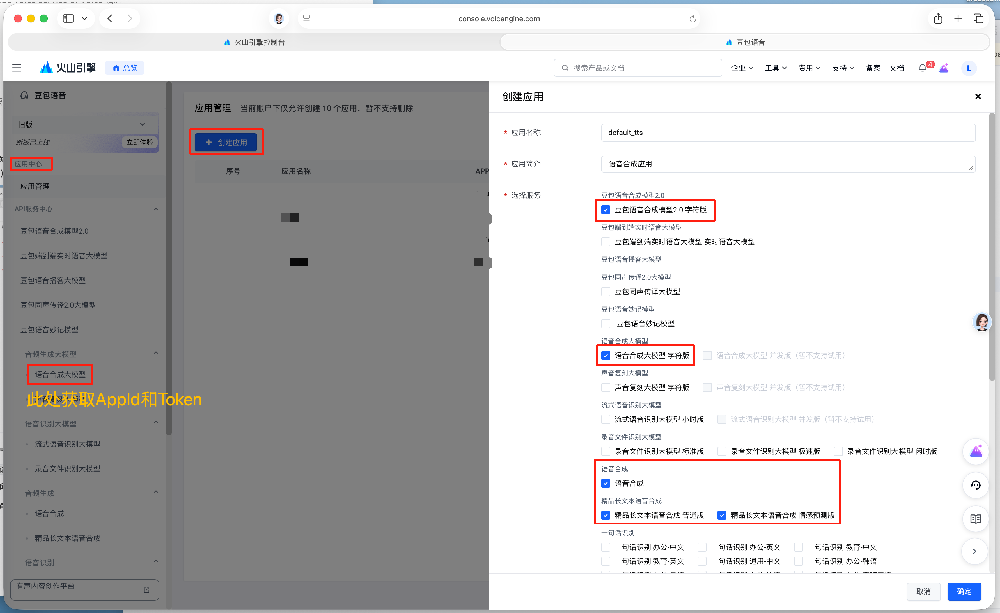

## 该工程已停止维护，请移步新的TTS应用[TalkifyTTS](https://github.com/LonePheasantWarrior/TalkifyTTS)

Talkify是一款支持多云端语音合成服务（豆包语音，阿里千问3等）的现代化TTS引擎。

# 火山引擎TTS

> 基于火山引擎豆包语音服务的在线安卓TTS应用
>
> An online TTS Android application based on the Doubao voice service of Volcengin

### 推荐搭配阅读软件

[Legado / 开源阅读](https://github.com/gedoor/legado)  
[Legado / 开源阅读 APP书源](https://github.com/aoaostar/legado)

### AppId和Token获取

> 该软件是基于火山引擎豆包语音合成服务工作的，需要获取相应在线服务的使用凭据

1. 前往火山引擎[控制台](https://console.volcengine.com)，注册登录账号

2. 前往[豆包语音/应用管理](https://console.volcengine.com/speech/app)（使用该服务要求实名注册）

3. 点击**创建应用**按钮，在**选择服务**区域把“语音合成”相关的服务都勾选上（不使用的项目并不会产生费用，语音合成服务费用并不高，并且推广期间会赠送试用额度）

   

4. 点击左侧导航栏中的**语音合成大模型**（位于`豆包语音/API服务中心/豆包语音妙记模型/音频生成大模型/语音合成大模型`）
   在该页面的下方的**服务接口认证信息**区域即可获得**APP ID**和**Access Token**

### 感谢

- [TTS](https://github.com/ag2s20150909/TTS)
- [TRAE](https://www.trae.cn)
- [DeepSeek](https://www.deepseek.com)
- [Qwen](https://www.aliyun.com/product/tongyi)
- [Kimi](https://www.kimi.com/zh/)
- [Copilot](https://copilot.microsoft.com/)

### 源码导入

- 需要将`gradle.properties`中`org.gradle.java.home`的值修改为**本地JavaHome**绝对路径
